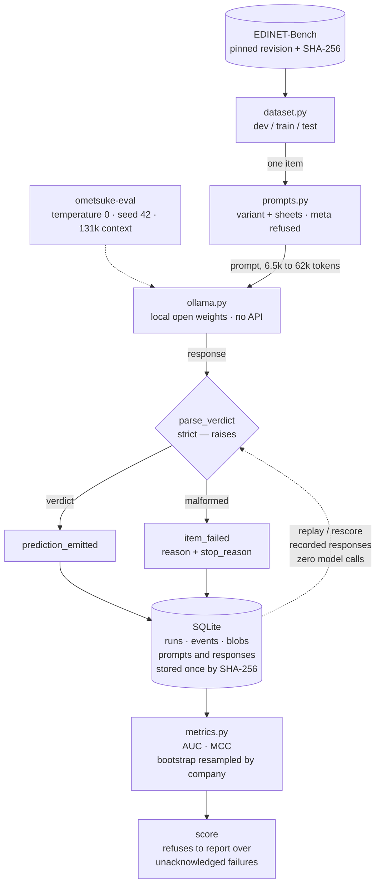

# Ometsuke

[](https://github.com/drag0sd0g/Ometsuke/actions/workflows/ci.yml)


**大目付** — the senior inspectorate of the Edo period.

An evaluation harness for Japanese accounting-fraud detection, built on
[EDINET-Bench](https://huggingface.co/datasets/SakanaAI/EDINET-Bench) (Sakana AI, ICLR 2026).
It runs entirely on local open weights, and its output is a number you can re-derive
months later rather than one you have to trust.

---

## Findings

**The released dataset cannot tell you why any filing was labelled fraud.**
`ammended_doc_id` is empty for 531 of 534 positives, along with `explanation`. The lookup
table in `prepare_dataset.py` is keyed by the amendment's id and looked up by the original
filing's, so the join misses everywhere. The evidence for every positive label is absent
from the published artifact.

**Filing date alone scores ROC-AUC 0.635** (95% company-clustered CI [0.549, 0.719]).
A filing only becomes a positive once its fraud has been found and amended, which takes
years — so positives are systematically older. Published baselines: 0.68 logistic
regression, 0.73 Claude 3.5 Sonnet with narrative text.

**534 positives come from 200 companies; the 122 test positives from 50.**
Filings from one company describe one scandal in near-identical language. Any interval
that resamples filings rather than companies is too narrow.

**Beneish's M-score lands below chance — ROC-AUC 0.438**, interval excluding 0.5, and
significantly worse than ranking the same filings by date. Not an era artifact, not
outliers. The accruals index carries the largest coefficient and is the most inverted of
the eight. → [docs/03](docs/03-forensic-accounting-features.md)

**Whether a filing can be scored at all depends on its label.** Statements parse
completely for 68.3% of rows, and those rows carry a 13-point higher fraud rate and a
1.6-year later mean fiscal year than the ones that drop out.

**Misconduct vocabulary is a minority of the evidence.** Across 574 recovered amendment
texts, only 35% contain 不適切な会計処理 / 粉飾 / 会計不正 / 不正 — and 誤記 / 誤植, the
obvious words for a clerical correction, appear in none of them.

→ [docs/02](docs/02-what-the-dataset-contains.md) for reproduction steps.

EDINET-Bench is roughly 49% fraud against a real-world rate well under 1%, so any score
here is a research claim, not a product claim.

---

## What's here

| | |
|---|---|
| [`docs/00`](docs/00-project-charter.md) | what the project claims and the constraints that fix its scope |
| [`docs/01`](docs/01-how-edinet-bench-labels-were-made.md) | how the fraud labels were built, verified against the shipped code |
| [`docs/02`](docs/02-what-the-dataset-contains.md) | what the dataset contains, with reproduction steps |
| [`docs/03`](docs/03-forensic-accounting-features.md) | Beneish's M-score on this benchmark, and why it fails |
| [`docs/04`](docs/04-background.md) | **new to the statistics or the accounting? start here** — every term, explained by analogy to distributed systems |
| `scripts/` | reconstruction of the amendment → filing mapping the dataset omits — a ten-year EDINET sweep, verified 15/15 against the XBRL element Sakana used, recovering 396 of 534 positives |
| `src/ometsuke/` | the harness |

## The harness



The dotted line back into `parse_verdict` is the point of the whole design. Model calls are
not deterministic even at fixed settings, so **replay means replaying
recorded responses, not regenerating them**. That separates *did my scoring logic change?*
from *did the model change?* — and pinned open weights make the second question tractable,
since the model is a file with a digest rather than a service that shifts underneath you.

Runs are an append-only SQLite event log with content-addressed prompts and responses.
Malformed output raises rather than being dropped, and scoring refuses to run over
unacknowledged failures; silent drops score an easier subset than the one advertised.
Correctness is asserted behaviourally — see `tests/`.

```bash
uv run ometsuke run --split dev                # record, on local weights
uv run ometsuke replay <run_id>                # re-derive, no model calls
uv run ometsuke score <run_id> --split dev     # AUC and MCC, clustered intervals
uv run pytest
```
